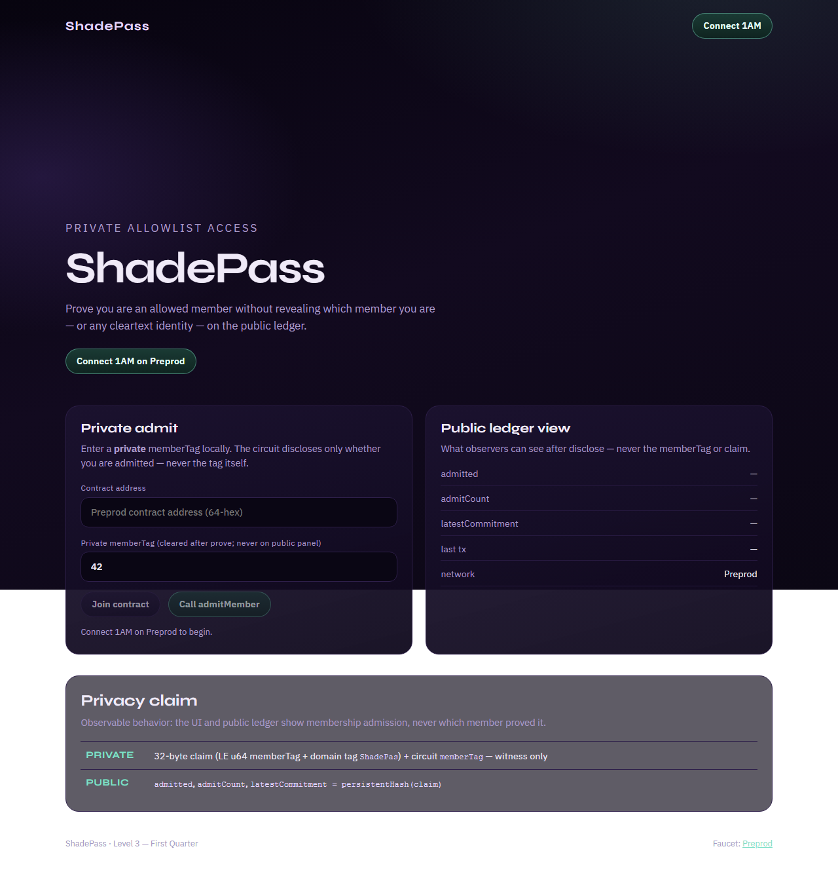
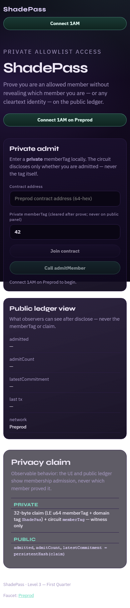
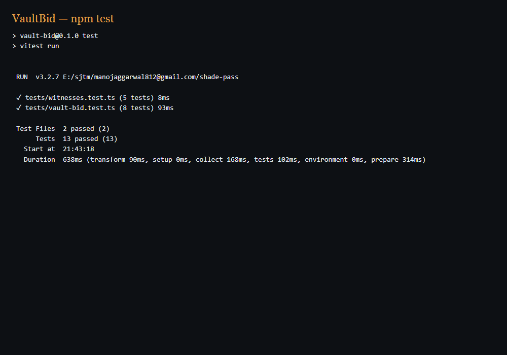
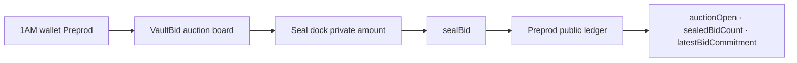

# VaultBid

[](https://github.com/nikkunjtayal/vault-bid/actions/workflows/ci.yml)

**Sealed-bid auction on Midnight Preprod — private bids, public sealed count + commitment (winner reveal later).**

| | |
|---|---|
| Public repo | https://github.com/nikkunjtayal/vault-bid |
| Live demo | https://vault-bid.vercel.app |
| Demo video | [vaultbid.mp4](https://drive.google.com/file/d/1O-HAv4bLrN6DIZdIo6_rPsaZm5xDkb7A/view?usp=sharing) · [script](docs/evidence/DEMO_VIDEO.md) |
| Product idea | **Sealed-Bid Auction** ([proposal](docs/evidence/PRODUCT_PROPOSAL.md)) |
| Preprod contract | `fd791ba296bc112e5169e16fa4654f462b935cfefe5be7dfc484ab591f7c954a` · label **Preprod** |
| Commits on `main` | ≥20 meaningful (Level 3) |
| Tests | **13 passing** (`npm test`) |
| CI | Passing on every push to `main` |

VaultBid is a Midnight Compact contract + **1AM** auction board. Bid amounts stay in a private witness; observers only see whether the auction is open, how many bids were sealed, and the latest commitment hash.

## Levels overview

| Level | Theme | Status |
|---|---|---|
| Level 1 — New Moon | Compile, tests, artifacts | ✅ Verified |
| Level 2 — Waxing Crescent | 1AM UI, Preprod, `sealBid`, live demo | ✅ Verified |
| Level 3 — First Quarter | CI/CD, polish, proposal, screenshots, video structure | ✅ Verified |
| Idea Submission (L4–6) | Sealed-Bid Auction · Confidential DeFi | ✅ Copy ready |

---

## Checklist — Level 1 (New Moon)

| # | Requirement | Status | Where |
|---|---|---|---|
| 1 | New Midnight Compact product (auction, not a form rename) | ✅ | `contracts/vault-bid.compact` |
| 2 | Compact `+0.31.1` managed artifacts | ✅ | `contracts/managed/vault-bid/` |
| 3 | ≥3 tests passing | ✅ | **13** Vitest (`tests/`) |
| 4 | Compile / artifact evidence | ✅ | managed keys + zkir committed |
| 5 | Public GitHub repo | ✅ | nikkunjtayal/vault-bid |
| 6 | README with product + privacy claim | ✅ | This file |
| 7 | ≥5 meaningful commits | ✅ | 20+ on `main` |
| 8 | MIT license | ✅ | `LICENSE` |

---

## Checklist — Level 2 (Waxing Crescent)

| # | Requirement | Status | Where |
|---|---|---|---|
| 1 | Frontend dApp wired to deployed contract | ✅ | `web/` + Preprod deploy/join |
| 2 | Wallet connect / disconnect | ✅ | 1AM (`selectWallet` + topbar) |
| 3 | Circuit call from UI | ✅ | **Seal bid** → `sealBid` |
| 4 | Privacy UX (public open/count/commitment only) | ✅ | Auction board + bid cleared |
| 5 | Preprod contract address | ✅ | Table below + `DEPLOYMENT.md` |
| 6 | Live demo URL | ✅ | https://vault-bid.vercel.app |
| 7 | Demo video structure | ✅ | `docs/evidence/DEMO_VIDEO.md` |
| 8 | ≥8 meaningful commits | ✅ | 20+ |
| 9 | README privacy model | ✅ | Section below |
| 10 | `dapp-connector-api` + midnight-js providers | ✅ | `web/src/lib/providers.ts` |

---

## Checklist — Level 3 (First Quarter)

| # | Requirement | Status | Where |
|---|---|---|---|
| 1 | Fully functional privacy dApp | ✅ | Live + Preprod path |
| 2 | ≥10 Vitest tests (circuits, ledger, witness encoding) | ✅ | **13** tests |
| 3 | CI/CD workflow + badge + passing runs | ✅ | [Actions](https://github.com/nikkunjtayal/vault-bid/actions/workflows/ci.yml) |
| 4 | Idea from provided list | ✅ | **Sealed-Bid Auction** |
| 5 | Product proposal for approval | ✅ | [PRODUCT_PROPOSAL.md](docs/evidence/PRODUCT_PROPOSAL.md) |
| 6 | ≥10 meaningful commits | ✅ | 20+ |
| 7 | Public GitHub + complete README | ✅ | This repo |
| 8 | Live demo link | ✅ | Vercel |
| 9 | Test output screenshot | ✅ | `docs/screenshots/test-results.png` |
| 10 | Desktop + mobile screenshots | ✅ | `docs/screenshots/*-live.png` |
| 11 | Demo video uploaded | ✅ | [Drive](https://drive.google.com/file/d/1O-HAv4bLrN6DIZdIo6_rPsaZm5xDkb7A/view?usp=sharing) |
| 12 | Privacy model / observer view | ✅ | Below |
| 13 | Code quality audit | ✅ | [CODE_QUALITY.md](docs/evidence/CODE_QUALITY.md) |

**Self-verify:** `npm test` → 13/13 · `npm --prefix web run build` → OK · CI on `main` → success.

---

## Screenshots

### Desktop live demo



### Mobile responsive (390×844)



### Tests — 13 passing



---

## Privacy model — what an observer can and cannot learn

| Data | Visibility | Where it lives | Notes |
|---|---|---|---|
| Private bid claim (`Bytes<32>`) | **PRIVATE** (witness) | Prover / 1AM session | Bytes 0..7 = LE `u64` bidAmount; bytes 24..31 = `VaultBid`. Never cleartext on ledger. |
| Circuit `bidAmount` param | **PRIVATE** | Circuit witness | Must match claim encoding. UI labels this field **PRIVATE bid amount**. |
| `auctionOpen` | **PUBLIC** | Ledger | Stays `true` for Level 2/3 sealed phase. |
| `sealedBidCount` | **PUBLIC** | Ledger `Counter` | Increments on every `sealBid`. |
| `latestBidCommitment` | **PUBLIC** after `disclose()` | Ledger | `persistentHash(claim)` — commitment, not the amount. |

**Observer learns:** that the auction is open, how many bids were sealed, and a commitment hash.  
**Observer cannot learn:** the bid amount, claim cleartext, or any winner amount in Level 2/3. Level 2/3 do **not** publish winner amounts.

---

## Architecture



---

## CI/CD

Every push and PR to `main` runs [`.github/workflows/ci.yml`](.github/workflows/ci.yml):

1. `npm ci`
2. `npm test`
3. `npm run web:sync-zk`
4. `npm --prefix web ci`
5. `npm --prefix web run build`

Compact compile stays local/WSL; managed artifacts are committed.

---

## Preprod deployment

| Field | Value |
|---|---|
| Network | **Preprod** |
| Contract | `fd791ba296bc112e5169e16fa4654f462b935cfefe5be7dfc484ab591f7c954a` — [DEPLOYMENT.md](docs/evidence/DEPLOYMENT.md) |
| Indexer | `https://indexer.preprod.midnight.network/api/v4/graphql` |
| Live app | https://vault-bid.vercel.app |

Flow: **Connect 1AM → Join/Deploy → enter PRIVATE bid → Seal bid**.

---

## Idea Submission

Copy-paste Q1 essay + Q2 category (**Confidential DeFi**) live in  
[docs/evidence/PRODUCT_PROPOSAL.md](docs/evidence/PRODUCT_PROPOSAL.md)  
(September Challenge Active). Level 4–6 = close/reveal, multi-lot, monitoring — still sealed-bid auction.

---

## Quick start

```bash
npm install
npm test
npm run web:sync-zk
npm --prefix web install
npm run web:dev
```

## License

MIT
