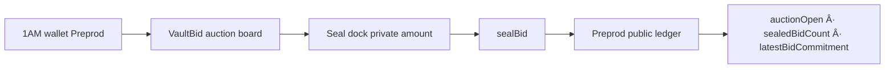

# VaultBid

[](https://github.com/Nikkunj-145/shade-pass/actions/workflows/ci.yml)

**Sealed-bid auction on Midnight Preprod — private bids, public sealed count + commitment (winner reveal later).**

| | |
|---|---|
| Public repo | https://github.com/Nikkunj-145/shade-pass |
| Live demo | https://shade-pass.vercel.app |
| Demo video | [DEMO_VIDEO.md](docs/evidence/DEMO_VIDEO.md) |
| Product idea | **Sealed-Bid Auction** ([proposal](docs/evidence/PRODUCT_PROPOSAL.md)) |
| Preprod contract | Pending new VaultBid deploy · label **Preprod** |
| Tests | Vitest (`npm test`) |

VaultBid is a Midnight Compact contract + **1AM** auction board. Bid amounts stay in a private witness; observers only see whether the auction is open, how many bids were sealed, and the latest commitment hash.

## Privacy model — observer view

| Data | Visibility | Notes |
|---|---|---|
| Private bid claim (`Bytes<32>`) | **PRIVATE** | LE `u64` bidAmount + domain tag `VaultBid`. Never cleartext on ledger. |
| Circuit `bidAmount` | **PRIVATE** | Must match claim encoding. UI labels **PRIVATE bid amount**. |
| `auctionOpen` | **PUBLIC** | Stays `true` for Level 2 sealed phase. |
| `sealedBidCount` | **PUBLIC** | Increments on every `sealBid`. |
| `latestBidCommitment` | **PUBLIC** | `persistentHash(claim)` — not the amount. |

**Observer never learns** the bid amount or claim cleartext.

## Architecture



## Checklist — Level 2 qualities retained

| Requirement | Status |
|---|---|
| 1AM connect / disconnect + address + errors + loading | ✅ |
| Providers: level, indexer, FetchZkConfig, dappConnectorProofProvider, wallet bridge | ✅ |
| Session-cached providers; indexer join (no watch hang); `ledger()` reads | ✅ |
| Circuit `sealBid` called from UI; private amount cleared after success | ✅ |
| Vitest green; DEFAULT_CONTRACT_ADDRESS cleared until new Preprod deploy | ✅ |

## Preprod deployment

| Field | Value |
|---|---|
| Network | **Preprod** |
| Contract | See [`DEPLOYMENT.md`](docs/evidence/DEPLOYMENT.md) — **redeploy required** (old allowlist address invalid) |
| Indexer | `https://indexer.preprod.midnight.network/api/v4/graphql` |

Flow: **Connect 1AM → Deploy auction → enter PRIVATE bid → Seal bid**.

## Quick start

```bash
npm install
npm test
npm run web:sync-zk
npm --prefix web install
npm run web:dev
```

## License

MIT


