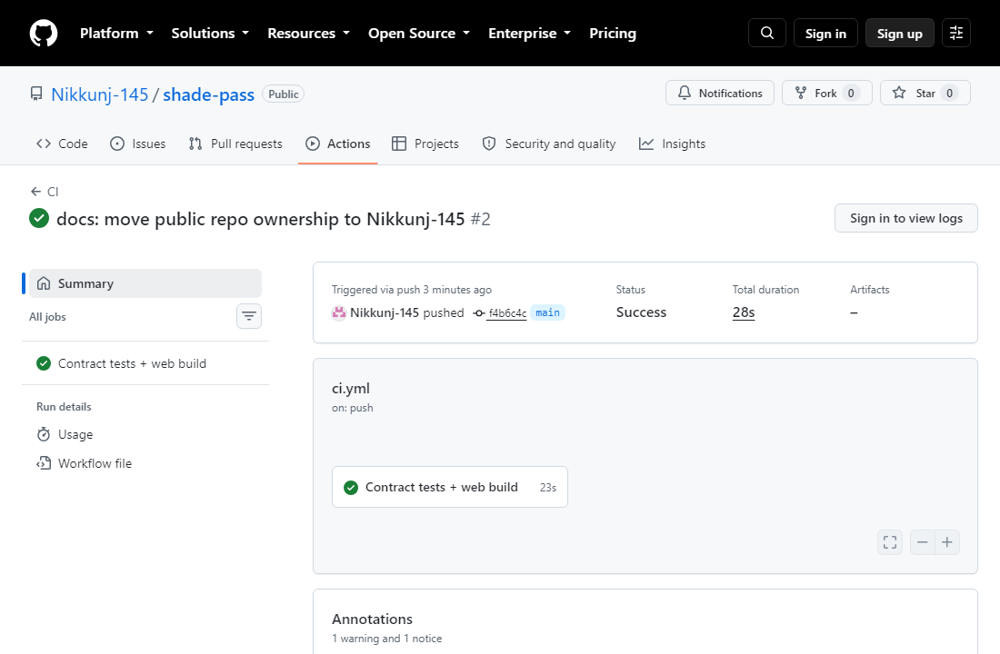
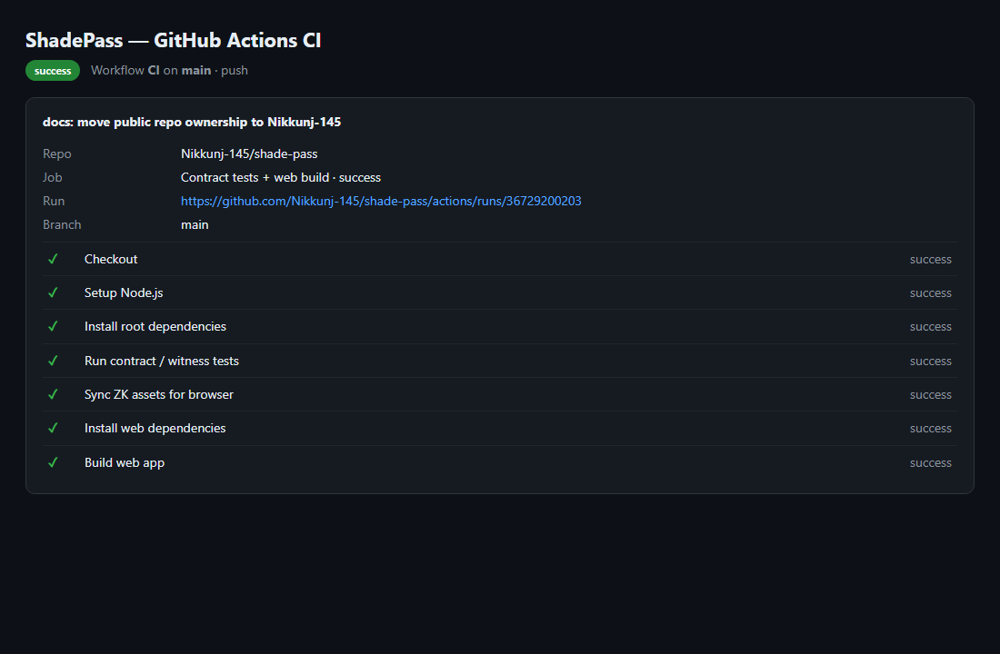
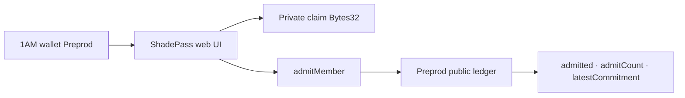

# ShadePass

[](https://github.com/Nikkunj-145/shade-pass/actions/workflows/ci.yml)

**Prove you are an allowed member of a private allowlist without revealing which member you are or any cleartext identity on the public ledger.**

| | |
|---|---|
| Public repo | https://github.com/Nikkunj-145/shade-pass |
| Live demo | https://shade-pass.vercel.app |
| Demo video | [DEMO_VIDEO.md](docs/evidence/DEMO_VIDEO.md) _(paste Drive/YouTube when ready)_ |
| Product idea | **Private Allowlist Access** ([proposal](docs/evidence/PRODUCT_PROPOSAL.md)) |
| Preprod contract | `e01a7e066dc7ddb3712c27e9975cd9523d3f7a283c6824f752933f4a5d6b3795` · **Preprod** |
| Commits on `main` | ≥10 meaningful (Level 3 polish) |
| Tests | **13 passing** (`npm test`) |
| CI | Passing on every push to `main` |

ShadePass is a Midnight Compact contract + **1AM** frontend for allowlist membership. The memberTag stays in a private witness; observers only see whether the prover was admitted, how many admits ran, and a commitment hash.

## Levels overview

| Level | Theme | Status |
|---|---|---|
| Level 1 — New Moon | Compile, tests, Preview path | ✅ Verified |
| Level 2 — Waxing Crescent | 1AM UI, Preprod, circuit call, live demo | ✅ Verified |
| Level 3 — First Quarter | CI/CD, polish, proposal, screenshots, video structure | ✅ Verified |
| Idea Submission (L4–6) | Private Allowlist Access → Identity/credentials | ✅ Copy ready |

---

## Checklist — Level 1 (New Moon)

| # | Requirement | Status | Where |
|---|---|---|---|
| 1 | New Midnight Compact product (not a clone rename) | ✅ | `contracts/shade-pass.compact` |
| 2 | Compact `+0.31.1` managed artifacts | ✅ | `contracts/managed/shade-pass/` |
| 3 | ≥3 tests passing | ✅ | **13** Vitest (`tests/`) |
| 4 | Compile / artifact evidence | ✅ | managed keys + zkir committed |
| 5 | Public GitHub repo | ✅ | Nikkunj-145/shade-pass |
| 6 | README with product + privacy claim | ✅ | This file |
| 7 | ≥5 meaningful commits | ✅ | 10+ on `main` |
| 8 | MIT license | ✅ | `LICENSE` |

---

## Checklist — Level 2 (Waxing Crescent)

| # | Requirement | Status | Where |
|---|---|---|---|
| 1 | Frontend dApp wired to deployed contract | ✅ | `web/` + Preprod deploy/join |
| 2 | Wallet connect / disconnect | ✅ | 1AM (`selectWallet` + topbar) |
| 3 | Circuit call from UI | ✅ | `Call admitMember` |
| 4 | Privacy UX (public admitted/count/commitment only) | ✅ | Public ledger panel + memberTag cleared |
| 5 | Preprod contract address | ✅ | Table below + `DEPLOYMENT.md` |
| 6 | Live demo URL | ✅ | https://shade-pass.vercel.app |
| 7 | Demo video structure | ✅ | `docs/evidence/DEMO_VIDEO.md` |
| 8 | ≥8 meaningful commits | ✅ | 10+ |
| 9 | README privacy model | ✅ | Section below |
| 10 | `dapp-connector-api` + midnight-js providers | ✅ | `web/src/lib/providers.ts` |

---

## Checklist — Level 3 (First Quarter)

| # | Requirement | Status | Where |
|---|---|---|---|
| 1 | Fully functional privacy dApp | ✅ | Live + Preprod path |
| 2 | ≥10 Vitest tests (circuits, ledger, witness encoding) | ✅ | **13** tests |
| 3 | CI/CD workflow + badge + passing runs | ✅ | [Actions](https://github.com/Nikkunj-145/shade-pass/actions/workflows/ci.yml) |
| 4 | Idea from provided list | ✅ | **Private Allowlist Access** |
| 5 | Product proposal for approval | ✅ | [PRODUCT_PROPOSAL.md](docs/evidence/PRODUCT_PROPOSAL.md) |
| 6 | ≥10 meaningful commits | ✅ | 10+ |
| 7 | Public GitHub + complete README | ✅ | This repo |
| 8 | Live demo link | ✅ | Vercel |
| 9 | Test output screenshot | ✅ | `docs/screenshots/test-results.png` |
| 10 | Desktop + mobile screenshots | ✅ | `docs/screenshots/*-live.png` |
| 11 | Demo video (link when uploaded) | ✅ | Structure ready in DEMO_VIDEO.md |
| 12 | Privacy model / observer view | ✅ | Below |
| 13 | Code quality audit | ✅ | [CODE_QUALITY.md](docs/evidence/CODE_QUALITY.md) |

**Self-verify:** `npm test` → 13/13 · `npm --prefix web run build` → OK · CI on `main` → success.

---

## Screenshots

### Desktop live demo


### Mobile responsive (390×844)


### Tests — 13 passing


### CI/CD — GitHub Actions (passing on `main`)





Run: https://github.com/Nikkunj-145/shade-pass/actions/runs/36729200203

---

## Privacy model — what an observer can and cannot learn

| Data | Visibility | Where it lives | Notes |
|---|---|---|---|
| Private claim (`Bytes<32>`) | **PRIVATE** (witness) | Prover / 1AM session | First 8 bytes = LE `u64` memberTag; trailing `ShadePas`. Never cleartext on ledger. |
| Circuit `memberTag` param | **PRIVATE** | Circuit witness | Must match claim encoding. UI labels this field **private**. |
| `admitted` | **PUBLIC** after `disclose()` | Ledger | Demo rule: `memberTag != 0`. |
| `admitCount` | **PUBLIC** | Ledger `Counter` | Increments on every `admitMember`. |
| `latestCommitment` | **PUBLIC** after `disclose()` | Ledger | `persistentHash(claim)` — commitment, not the tag. |

**Observer learns:** that an admit ran, whether membership passed the demo rule, a commitment hash, and the admit count.  
**Observer cannot learn:** the memberTag, which allowlist slot was used, or any cleartext identity / roster.

---

## Architecture



---

## CI/CD

Every push / PR to `main` runs:

1. `npm ci`
2. `npm test`
3. `npm run web:sync-zk`
4. `npm --prefix web ci`
5. `npm --prefix web run build`

Workflow: [`.github/workflows/ci.yml`](./.github/workflows/ci.yml)

Compact compile stays local/WSL (`npm run compile:wsl`); managed artifacts are committed.

---

## Preprod deployment

| Field | Value |
|---|---|
| Network label | **Preprod** |
| Contract address (64-hex) | `e01a7e066dc7ddb3712c27e9975cd9523d3f7a283c6824f752933f4a5d6b3795` |
| Evidence | [`docs/evidence/DEPLOYMENT.md`](./docs/evidence/DEPLOYMENT.md) |
| Indexer | `https://indexer.preprod.midnight.network/api/v4/graphql` |
| Live app | https://shade-pass.vercel.app |

Deployed via **1AM UI** on Preprod. Live demo prefills this address for Join / `admitMember`.

---

## Idea Submission paste

Copy Q1 / Q2 answers from [`docs/evidence/PRODUCT_PROPOSAL.md`](./docs/evidence/PRODUCT_PROPOSAL.md).

---

## Quick start

```bash
npm install
npm test
npm run web:sync-zk
npm --prefix web install
npm run web:dev
```

## License

MIT © Nikkunj
