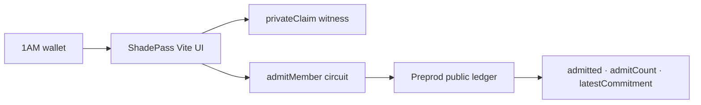

# ShadePass

**Prove you are an allowed member of a private allowlist without revealing which member you are or any cleartext identity on the public ledger.**

ShadePass is a Midnight Compact + 1AM browser dApp on **Preprod**. Clubs, beta programs, airdrops, and gated apps can answer only `admitted=true/false` with a commitment + counter — never the member tag.

| | |
|---|---|
| **GitHub** | https://github.com/manojaggarwal812/shade-pass |
| **Live demo** | _pending Vercel deploy_ |
| **Network** | Preprod |
| **Level** | 2 — Waxing Crescent |

---

## Privacy model

| | What |
|---|---|
| **PRIVATE** | 32-byte claim (first 8 bytes LE `u64` memberTag + trailing domain tag `ShadePas`) and circuit param `memberTag` — witness / private circuit input only |
| **PUBLIC** | `admitted` (Boolean), `admitCount` (Counter), `latestCommitment` (`Bytes<32>` = `persistentHash(claim)`) |

### What an observer can learn

- That a membership prove happened (`admitCount` increments)
- Whether the prover was admitted under the demo rule (`memberTag != 0`)
- The hash commitment of the private claim

### What an observer cannot learn

- The memberTag value
- Which allowlist slot / identity was used
- The cleartext claim bytes
- Any email, wallet list, or membership roster

---

## Architecture



---

## Preprod contract

| Field | Value |
|---|---|
| Contract address (64-hex) | _fill after deploy — see [`docs/evidence/DEPLOYMENT.md`](./docs/evidence/DEPLOYMENT.md)_ |
| Indexer | `https://indexer.preprod.midnight.network/api/v4/graphql` |

Deploy from the live UI (**Connect 1AM → Deploy to Preprod**) or:

```bash
MIDNIGHT_NETWORK=preprod MIDNIGHT_SEED=<64-hex> npm run deploy:preprod
```

---

## Level 2 checklist (Waxing Crescent)

- [x] Midnight.js SDK + `@midnight-ntwrk/dapp-connector-api` present and used
- [x] Providers: privateState (level), publicData (indexer), zkConfig (fetch), proof, wallet, midnight
- [x] Wallet bridge: ConnectedAPI → `balanceUnsealedTransaction` + `submitTransaction`
- [x] Circuit wrappers: deploy / join / callTx around compiled Compact contract
- [x] 1AM connect + disconnect (`window.midnight['1am']`; Lace fallback OK)
- [x] Unshielded address in topbar when connected
- [x] Error handling + loading/busy on connect / deploy / join / call
- [x] Circuit `admitMember` called directly from the UI
- [x] Browser proving prefers `@midnight-ntwrk/midnight-js-dapp-connector-proof-provider`; HTTP proof-server fallback
- [x] Private inputs labeled private; public panel shows only admitted / admitCount / commitment
- [ ] Live demo URL on Vercel
- [ ] Preprod contract address recorded in README + `docs/evidence/DEPLOYMENT.md`
- [x] README privacy model (this section)
- [ ] ≥8 meaningful commits on `main` (public GitHub)
- [x] Vitest suite (≥6 tests: artifacts + ledger + admit true/false)
- [x] Network: Preprod (`setNetworkId('preprod')`)

---

## Quick start

```bash
# requires Node ≥22 + Compact compiler (WSL: ~/.local/bin/compact)
npm install
npm run compile:wsl          # or: npm run compile
npm test
npm run web:sync-zk
npm --prefix web install
npm run web:dev              # http://localhost:5173
```

Demo flow: **Connect 1AM → Deploy or Join → enter private memberTag → Call admitMember → public panel updates; private field clears.**

Under-demo: `memberTag = 0` → call succeeds with `admitted=false`.

---

## Repository layout

```
shade-pass/
├── contracts/shade-pass.compact
├── contracts/managed/shade-pass/   # compiler, contract, keys, zkir
├── src/witnesses.ts
├── src/deploy.ts + network/utils
├── tests/shade-pass.test.ts
├── web/                            # Vite + React + 1AM
├── docs/evidence/
└── vercel.json
```

---

## Docs

- [`docs/evidence/DEPLOYMENT.md`](./docs/evidence/DEPLOYMENT.md)
- [`docs/evidence/LIVE_DEMO.md`](./docs/evidence/LIVE_DEMO.md)
- [`docs/evidence/DEMO_VIDEO.md`](./docs/evidence/DEMO_VIDEO.md)
- [`docs/evidence/SUBMISSION.md`](./docs/evidence/SUBMISSION.md)
- [`docs/evidence/CODE_QUALITY.md`](./docs/evidence/CODE_QUALITY.md)

## License

MIT © Manoj Aggarwal
